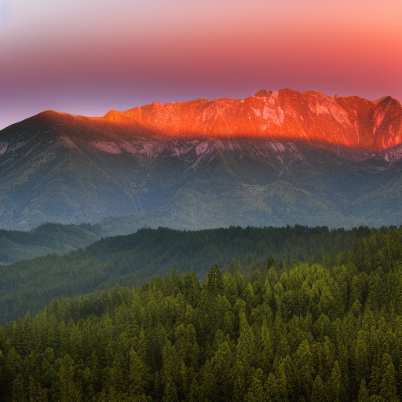

# Text-to-Image Generation Model

Neural network implementation for generating images from textual descriptions using deep learning techniques. This project combines natural language processing with computer vision to create a model capable of understanding text prompts and generating corresponding visual content. This model can also generate images from input images with a varying amount of resemblence to the original image. 

## 🎯 Project Overview

This text-to-image model leverages the power of generative adversarial networks (GANs) and transformer architectures to bridge the gap between natural language and visual representation. The core idea is to learn a joint embedding space where textual descriptions and images can be meaningfully compared and transformed.

### Key Concepts

- **Text Encoding**: Converting natural language descriptions into dense vector representations that capture semantic meaning
- **Image Generation**: Using learned representations to synthesize realistic images that match the input text
- **Cross-Modal Learning**: Training the model to understand relationships between textual and visual modalities
- **Latent Space Manipulation**: Operating in a compressed representation space for efficient generation

## 🌊 Understanding Diffusion: The Magic Behind Image Generation

Diffusion models work on a simple yet powerful concept inspired by physics. Imagine watching a drop of ink slowly spreading through water, this is diffusion in the physical world. The model reverses this process to create images.

### The Diffusion Process Explained

#### Forward Process (Adding Noise)
Think of starting with a clear photograph and gradually adding random static or "noise" to it:

```
Clear Image → Slightly Noisy → More Noisy → Very Noisy → Pure Random Noise
    Step 0      Step 1         Step 2       Step 3       Step 1000
```

At each step, a small amount of random noise is added until the original image becomes completely unrecognizable.This is like watching that ink drop spread until the water is uniformly colored.

#### Reverse Process (Removing Noise)
When reversing the process: 

```
Pure Random Noise → Less Noisy → Cleaner → Almost Clear → Perfect Image
     Step 1000       Step 999     Step 2      Step 1       Step 0
```

The model learns to predict: "If I have this noisy image, what should it look like with just a little less noise?"

### Why This Works So Well

1. **Gradual Learning**: Instead of trying to create a perfect image in one shot (which is incredibly hard), the model learns to make tiny improvements across many steps.

2. **Controllable Generation**: At each denoising step, we can guide the process using our text description. 

3. **High Quality Results**: Because each step only makes small changes, the final result maintains fine details and looks very realistic.

### The Text Conditioning Magic

When text is added to the process, the model essentially has instructions at each denoising step:

```
Text: "A red rose in a garden"
Step 500: "This noise should become something red and flower-like"
Step 300: "Make it more rose-shaped with petals"
Step 100: "Add the garden background and fine details"
Step 0: "Perfect! A beautiful red rose in a garden"
```

The model has learned that certain text descriptions correspond to certain visual patterns, and it uses this knowledge to guide the denoising process toward images that match your prompt.

### Technical Intuition

- **DDPM (Denoising Diffusion Probabilistic Models)**: The mathematical framework that makes this all possible
- **U-Net Architecture**: The neural network that predicts how to remove noise at each step
- **Scheduler**: Controls how much noise to remove at each step 
- **Cross-Attention**: The mechanism that lets text guide each denoising step

This approach has revolutionized image generation because it's both mathematically elegant and produces incredibly high-quality, controllable results!

## 🏗️ Model Architecture

The model consists of several interconnected components working together:

```
Text Input → Text Encoder → Cross-Attention → Generator → Generated Image
              ↓                    ↑
         Text Features ←→ Image Features ← Discriminator ← Real Images
```

### Core Components

## More information about each component can be found in the file
1. **attention.py**
2. **clip.py**
3. **ddpm.py**
4. **decoder.py**
5. **diffusion.py**
6. **encoder.py**
7. **model_loader.py**
8. **pipeline.py**

## 🚀 Installation and Setup

### Prerequisites
```bash
Python 3.8+
CUDA-compatible GPU (recommended)
```

### Dependencies
```bash
pip install torch torchvision
pip install transformers
pip install pillow
pip install numpy
pip install matplotlib
pip install tqdm
```

### Data Download 
Starting files need to be downloaded, and placed in a data folder, from this [link](https://huggingface.co/stable-diffusion-v1-5/stable-diffusion-v1-5/tree/main)
1. `merges.txt`
2. `vocab.json`
3. `v1-5-pruned-emaonly.ckpt`

## 🔧 Model Performance and Tuning

### Key Hyperparameters
- **Learning Rate**: Start with 2e-4, reduce if training is unstable
- **Batch Size**: 16-32 depending on GPU memory
- **Text Encoder Dimension**: 512 provides good semantic representation
- **Latent Dimension**: 256-512 for detailed image generation

### Training Tips
1. Use mixed precision training for faster convergence
2. Implement gradient clipping to prevent instability
3. Schedule learning rate decay after initial convergence
4. Monitor both adversarial and reconstruction losses
5. Use progressive training (start with low resolution, increase gradually)

## 🎨 Example Results

Generate stunning images from simple text descriptions:

### Text-to-Image Examples

**Prompt 1:** "A cat stretching on the floor, highly detailed, ultra sharp, cinematic, 100mm lens, 8k resolution."


**Prompt 2:** "A dog playing with a ball in a sunny park, vibrant colors, high contrast, 50mm lens, 4k resolution."


**Prompt 3:** "A serene mountain landscape at sunrise, soft lighting, wide angle, 16:9 aspect ratio, 6k resolution."



**Prompt 4:** "Abstract geometric patterns in vibrant blues and oranges, modern art style, high contrast"


### Image-to-Image Examples

Starting with an input image and modifying it with text prompts:

| Input Image | Prompt | Output Image |
|-------------|--------|--------------|
|  | "Same scene but at sunset with warm colors" |  |
|  | "Portrait in the style of Van Gogh" |  |

## 🔍 Technical Details

### Loss Functions
- **Adversarial Loss**: Ensures realistic image generation
- **Reconstruction Loss**: Maintains content fidelity
- **Perceptual Loss**: Preserves semantic features
- **Text-Image Alignment Loss**: Ensures prompt adherence

### Optimization Strategy
- Adam optimizer with β1=0.5, β2=0.999
- Learning rate scheduling with warmup
- Gradient penalty for stable training
- Spectral normalization in discriminator

## 🙏 Acknowledgments

- Built following the tutorial from Umar Jamil in the video: [Coding Stable Diffusion from scratch in PyTorch](https://www.youtube.com/watch?v=ZBKpAp_6TGI&t=2246s)

